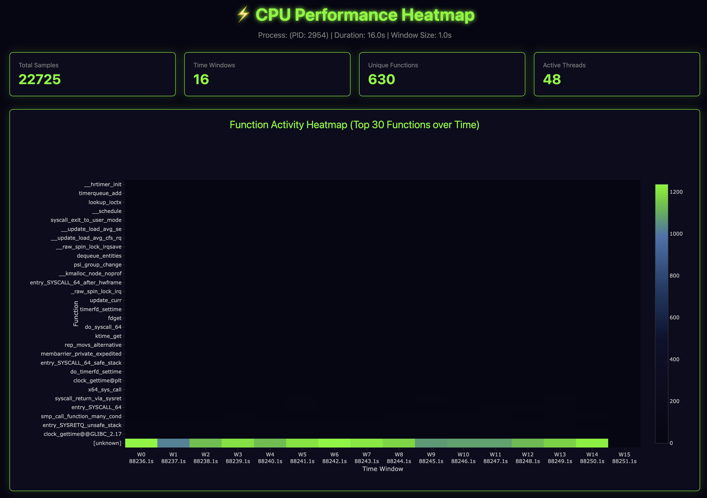
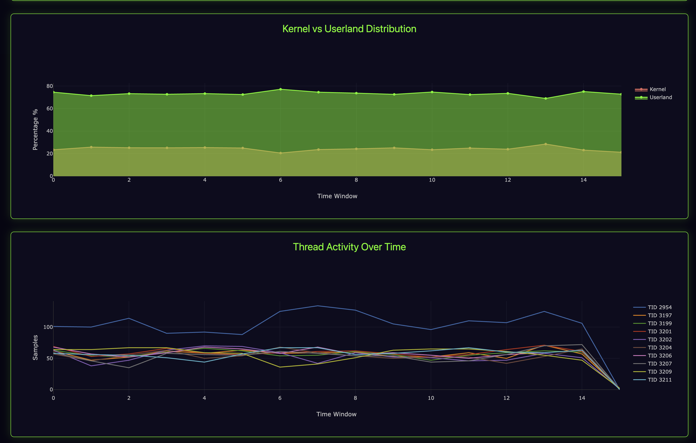
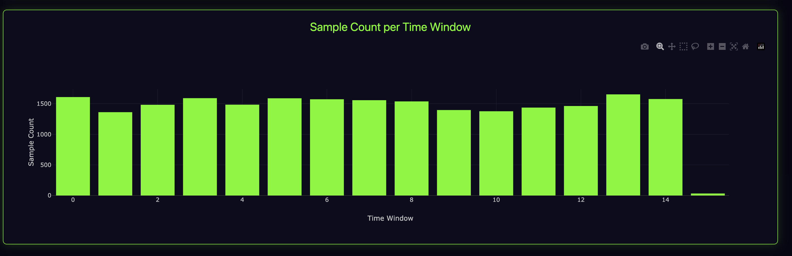

# Examples and Screenshots

This document showcases real examples and visualizations generated by BLC Perf Analyzer.

## Example Output: CPU Performance Heatmap

### Overview Dashboard



The main heatmap view shows:
- **Total Samples**: 22,725 captured samples
- **Time Windows**: 16 analysis windows
- **Unique Functions**: 630 different functions identified
- **Active Threads**: 48 concurrent threads

### Function Activity Over Time

The heatmap displays the top 30 most active functions across time windows. The color intensity represents sample count:
- **Green**: High activity (1200+ samples)
- **Blue**: Medium activity (600-800 samples)
- **Dark**: Low activity (<200 samples)

**Key insights from this capture:**
- `[unknown]` dominates (expected for stripped binaries)
- Kernel functions visible: `entry_SYSCALL_64`, `do_syscall_64`, `syscall_exit_to_user_mode`
- Timer-related activity: `__hrtimer_init`, `timerqueue_add`
- Memory management: `lookup_ioctx`, `__update_load_avg_se`

### Kernel vs Userland Distribution



This area chart shows the percentage distribution between:
- **Userland** (green): ~75% - Application code execution
- **Kernel** (red): ~25% - System calls and kernel operations

**Analysis:**
- Consistent distribution across time windows
- Slight variations indicating I/O operations
- Healthy balance for a typical database workload

### Thread Activity Over Time

The bottom chart shows individual thread activity:
- **TID 2954**: Main thread with highest activity (~100-120 samples)
- Multiple worker threads (TID 3197, 3199, 3201, etc.)
- Clear drop-off at window 14-15 (process completing)

### Sample Count Distribution



Bar chart showing sample consistency:
- ~1,500 samples per time window
- Uniform distribution (good capture quality)
- Slight drop at the end (expected as capture completes)

---

## Command Used

```bash
sudo blc-perf-analyzer --process scylla --duration 16 --generate-heatmap --heatmap-window-size 1.0
```

**Parameters:**
- Process: ScyllaDB
- Duration: 16 seconds
- Window size: 1.0 second
- Result: 16 time windows with 22,725 total samples

---

## Understanding the Output

### When to Use This Analysis

1. **Production Troubleshooting**: See exactly when CPU spikes occurred
2. **Performance Tuning**: Identify hot functions over time
3. **Anomaly Detection**: Spot unusual patterns in thread activity
4. **Capacity Planning**: Understand kernel vs userland distribution

### What to Look For

- **Temporal patterns**: Did CPU usage spike at specific times?
- **Function dominance**: Which functions consume most CPU?
- **Thread behavior**: Are threads balanced or is one thread overloaded?
- **Kernel overhead**: High kernel percentage suggests I/O or syscall issues

### Next Steps After Analysis

1. **High `[unknown]`**: Install debug symbols for detailed function names
2. **Kernel-heavy**: Investigate I/O patterns or syscall frequency
3. **Single hot thread**: Consider parallelization opportunities
4. **Periodic spikes**: Correlate with application events (batch jobs, cron)

---

## Additional Examples

See the repository's `example-*.html` files for more interactive examples:
- `example-demo-heatmap.html` - Demo workload (951K samples)
- `example-mariadb-heatmap.html` - MariaDB under load (740K samples)
- `example-heatmap.html` - ScyllaDB baseline (22K samples)

All examples include interactive features:
- Zoom in/out on time windows
- Hover for exact sample counts
- Toggle between different views
- Export as static images

